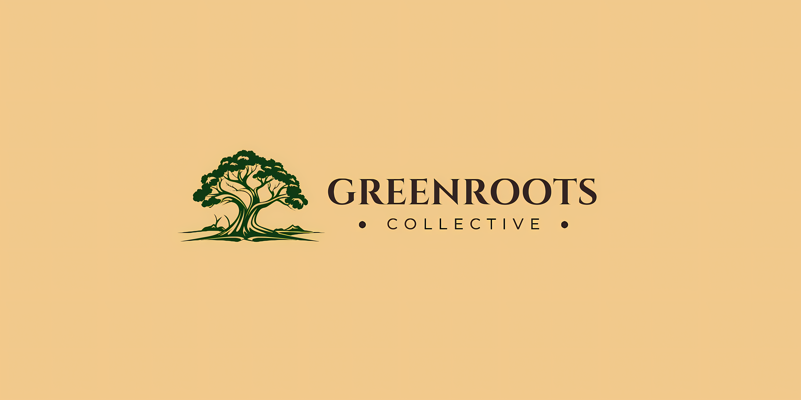

  
  
  # GreenRoots Collective
  
  **Where seeds grow into tomorrow's change**
  
  🌱 Making our school greener, more sustainable, and more inspiring
  
  
  

## 🌍 About Us

Welcome to GreenRoots Collective, where our mission is to make our school greener, more sustainable, and more inspiring for students. Here you can explore the challenges our world and school are facing, the solutions we are building, and our first big project: a vibrant school garden and club that creates real change through action.

Founded in **October 2024** by Mazen Choumari, GreenRoots Collective is committed to transforming school spaces into lively gardens where students can plant, explore nature, and learn about sustainability through fun, hands-on activities.

## 🎯 Our Mission

Create green spaces where students can learn about sustainability through engaging, hands-on activities that teach responsibility, creativity, teamwork, and real-life skills.

## 🌟 Our Vision

A school where green spaces inspire curiosity, creativity, awareness, and long-term care for the community and planet.

## 💡 Core Values

We focus on three fundamental pillars:

- **Innovation** - Exploring creative solutions for sustainability challenges
- **Education** - Making learning interactive, enjoyable, and meaningful
- **Collaboration** - Working together to build a greener future

## 🌿 What We Do

Every activity we propose is designed to provide students with:

- Hands-on gardening and environmental experiences
- Understanding of sustainability principles
- Development of responsibility and teamwork skills
- Connection with nature and their community
- Opportunities to make real, measurable impact

## 🚀 Get Involved

Whether you're a student looking to make a difference or a visitor curious about what we're growing, there are many ways to participate:

- Join our school garden club
- Attend our upcoming activities and workshops
- Share your ideas for sustainability projects
- Help us spread the word about environmental action

## 📫 Contact

Interested in learning more or getting involved? Reach out to us!

- **Email**: contact@greenroots.tech
- **Website**: [greenroots.tech](https://greenroots.tech)

---

  Planting the seeds of a brighter tomorrow 🌱

